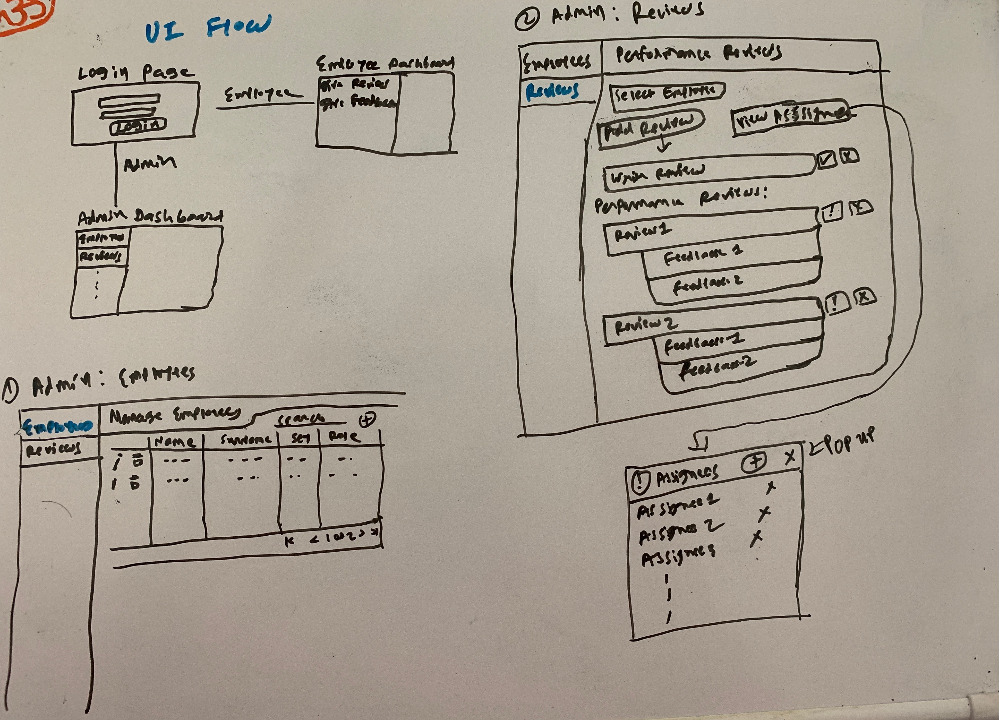

## UI Design

In the beginning phase of development, I started thinking about how UI should look like. After understanding challenge and definitions, I started my assumptions which I listed in [separate doc](./assumptions.md).

The initial design is very basic and then I modified as I went ahead in thinking process. So without talking and writing more, I will upload photos of my whiteboard!

That shows how I thought and how is UI flow in the app.

It's not 100% similar to implementation but I tried to follow. But during implementaion also new idea or improvement thought came, so that can be different from images here!

- [Overall super basic flow](#overall-super-basic-flow)
- [Admin page: Employee listing page](#admin-page-employee-listing-page)
- [Admin page: Review and Asignment management page](#admin-page-review-and-asignment-management-page)
- [Employee page: Assigned to you page](#employee-page-assigned-to-you-page)
- [Employee page: Write feedback page](#employee-page-write-feedback-page)
- [Process of assignment](#process-of-assignment)

### Overall super basic flow

### Admin page: Employee listing page

### Admin page: Review and Asignment management page

### Employee page: Assigned to you page

### Employee page: Write feedback page

### Process of assignment
